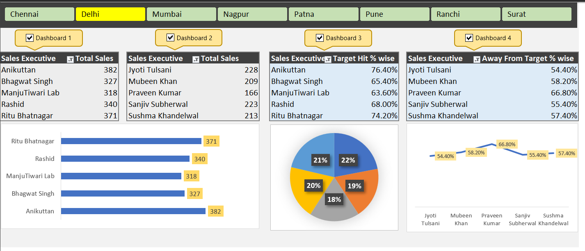

# Sales Performance Dashboard — Excel Project

An Excel dashboard analysing the sales performance of 141 sales executives across 8 regions in India.

---

## Short Description

An interactive Excel dashboard built to track and compare sales performance across a team of 141 executives. It identifies top performers, underperformers, target achievement percentages, and regional trends — all in a single screen view.

---

## Business Objective

The goal of this dashboard is to help sales managers quickly identify who is hitting their targets, who needs support, and how each region is performing — without manually going through raw data.

---

## Tools Used

- Microsoft Excel
- Pivot Tables
- VBA Macros
- Slicers
- Charts

---

## Dataset

**File:** `Sales_Performance_Dashboard.xlsm`

141 sales executives across 8 Indian cities — Mumbai, Delhi, Nagpur, Chennai, Pune, Patna, Ranchi, and Surat. Data covers 5 days of sales with a target of 500 units per executive.

| Column | Description |
|--------|-------------|
| Emp Code | Unique employee code |
| Sales Executive | Name of the executive |
| Region | Assigned city |
| Day1 – Day5 | Daily sales figures |
| Total Sales | Sum of Day1 to Day5 |
| Target | Monthly sales target (500 units) |
| Target Hit % | Percentage of target achieved |
| Away From Target % | Gap remaining from target |

---

## What I Built

- 4 coordinated pivot tables — Top 5 by sales, Bottom 5 by sales, Top 5 by target hit %, Bottom 5 by away from target %
- 3 charts visualising top and bottom performers
- Region slicer filtering all pivots and charts simultaneously
- VBA macros for dashboard refresh and automation
- Formulas — SUM for total sales, percentage calculations for Target Hit % and Away From Target %

---

## Key Numbers

Top 5 Sales Executives:

| Rank | Name | Total Sales |
|------|------|-------------|
| 1 | Anikuttan | 382 |
| 2 | Ritu Bhatnagar | 371 |
| 3 | Rashid | 340 |
| 4 | Bhagwat Singh | 327 |
| 5 | ManjuTiwari Lab | 318 |

Bottom 5 Sales Executives:

| Rank | Name | Total Sales |
|------|------|-------------|
| 1 | Jyoti Tulsani | 228 |
| 2 | Sanjiv Subherwal | 223 |
| 3 | Sushma Khandelwal | 213 |
| 4 | Mubeen Khan | 209 |
| 5 | Praveen Kumar | 166 |

---

## Key Findings

- Anikuttan leads with 382 total sales and 76.4% target achievement
- Praveen Kumar is furthest from target at 66.8% away
- No executive hit the 500 unit target in the 5-day period
- Regional performance varies significantly — the region slicer allows managers to isolate city-level trends

---

## How to Use

1. Download `Sales_Performance_Dashboard.xlsm`
2. Open in Microsoft Excel with macros enabled
3. Navigate to the DASHBOARD sheet
4. Use the Region slicer to filter by city
5. View the RAW DATA sheet to see the underlying dataset

> This is a macro-enabled workbook (.xlsm) — make sure macros are enabled on open.

---

## Dashboard Preview

